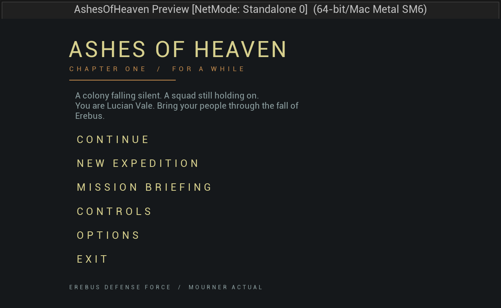
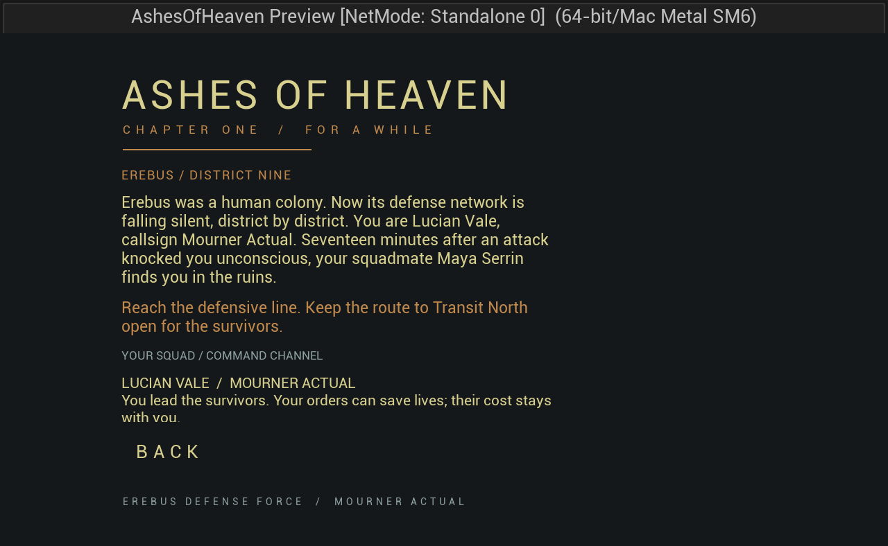

# Chapter One presentation pass

The playable chapter remains **FOR A WHILE**: Lucian and Maya survive the fall of
Erebus, discover that the Veil is converting the population, reach the Cathedral,
authorize the planetary failsafe, and escape before Nysa's final transmission.

## Player-facing changes

- The front end introduces Lucian and the mission before the player starts.
- Mission Briefing is available from both the front end and the pause menu. The
  pause version explains the current situation and immediate orders. Opening
  briefing withholds the failsafe and Nysa revelations.
- Squad dossiers introduce Lucian Vale, Maya Serrin, Admiral Sael Varek and Ivo
  Ren. Subtitles identify speakers and their command or squad role.
- The opening transitions from the canonical two-line cold open into a fading
  chapter/location title over Erebus. Objectives remain more legible after their
  initial prominence settles.
- Maya is visibly staged at the opening, transit, terminal decision and shelter.
  Story figures play the existing mannequin idle animation with independent
  phases instead of remaining in the reference pose. They do not block navigation
  or participate in combat; this is scene blocking, not an escort AI.
- The revelation objective asks the player to check on the survivor. The order
  objective directs the player into the Cathedral, matching its actual trigger.

## Rendering and sound

Thirty-two saved practical lights across Erebus, Transit and Cathedral had static
mobility and default intensity. They now use movable, unshadowed light components
with explicit candela values, warm human/fire colors and cooler Veil spill. The
global grade uses a 320-lux key, an EV100 exposure range of 3.2–6.0, a gentler film
toe and vignette, and fog beginning beyond the immediate foreground.

The audio subsystem now binds after the game instance is attached. Adjacent beats
in the same location retain one ambience component. Environment changes crossfade;
dialogue lowers the ambience; cold open and chapter completion resolve to silence.
Ambience and voices no longer persist across map travel. Radio cues occur at the
start of a radio-led sequence rather than at every subtitle. Assigned voice assets
now play, extend subtitle timing to their duration, and stop when skipped.
Queued voice assets remain referenced through garbage collection. Completion of a
previous one-shot cannot release ambience ducking while another sequence speaks.

No new voice recordings or music were added. Existing authored sound banks remain
the source of gameplay audio.

Live validation also found an existing encounter hitch: the shared spawn query
used an AI-controller navigation meta filter even though the player pawn owns the
query. Its projection now uses the generic navigation filter. The full opening
roster spawned after the change. The spider material's missing AO texture reference
now resolves to the engine's neutral white texture.

## Reproduction

After regenerating a presentation level, run
`python3 Scripts/RunInEditor.py Scripts/PolishChapterPresentation.py` outside PIE.
The pass modifies existing lights only, validates the applied settings, saves each
level, and restores the previously open map. Save and back up the maps first.
The report is written to `Saved/ProfessionalPass/lighting.json`.

The recovery snapshot for this pass is in
`Saved/Backups/ProfessionalPass-20260907/`, with the baseline Git revision recorded.

## Production work still required

This is an integrated playable presentation pass, not a declaration of shipping
quality. Lucian, Maya and the soldiers still use mannequin meshes. Final character
sculpts, clothing, facial rigs, dialogue performance, authored cinematic motion,
original score and a listening-approved mix remain production work. The procedural
environment kit also needs artist refinement, and performance needs measurement
on target hardware. Automated progression cannot replace a human combat playtest.

Observed rendering debt includes a Lumen surface-cache capacity warning in the
Cathedral and translucent saliva on the Nanite Teuthisan mesh. These require an
asset/performance pass; increasing GPU allocations without profiling is not part
of this change. Cathedral geometry and proxy character art are still visibly
unfinished.

## Validation evidence

Actual Unreal Play-In-Editor menu captures:

Actual engine captures are under `Saved/Screenshots/MacEditor/ProfessionalPass_*`:
front end, briefing, cold open, title reveal, Erebus gameplay and Cathedral views.
The final automation report is `Saved/ProfessionalPass/Automation/index.json`.
The test runner log is `Saved/ProfessionalPass/TestRun.log`.
The final suite passes 121 tests, including 20 Level One tests. Mac Shipping
compilation, cooking, staging and shader-payload validation pass; its log is
`Saved/ProfessionalPass/Shipping.log`. Tracked evidence files record both results
against the tested source, scripts, configuration and tracked content.

The Mac Development package also passes compilation, cooking, staging and
shader-payload validation. The packaged lifecycle harness completes all 12
objectives, verifies inventory and vehicle state after death, restores the failsafe
window after expiry, and confirms chapter completion after a second process
launch. Logs are in `Saved/ProfessionalPass/PackagedE2E.log` and
`Saved/ProfessionalPass/LevelOneE2E-Run{1,2}.log`. This run used headless rendering
and muted audio; it validates campaign state, not visual or listening quality.
The existing packaged player save was backed up and restored after the run.

`Scripts/Validate-CrossPlatform.sh` passes source/configuration checks, Python
regressions, shader packaging checks and exact-tree evidence validation. Windows,
iOS and Android binaries were not built during this pass.

Build and automation scripts explicitly disable hot reload. An open secondary
editor had caused a new suffixed library to be compiled while headless tests loaded
the previous library from the module manifest. Verification now rebuilds the normal
module. Opening-fade coverage also checks that a throttled UI tick cannot leave the
title visible after the dialogue clock has advanced.
